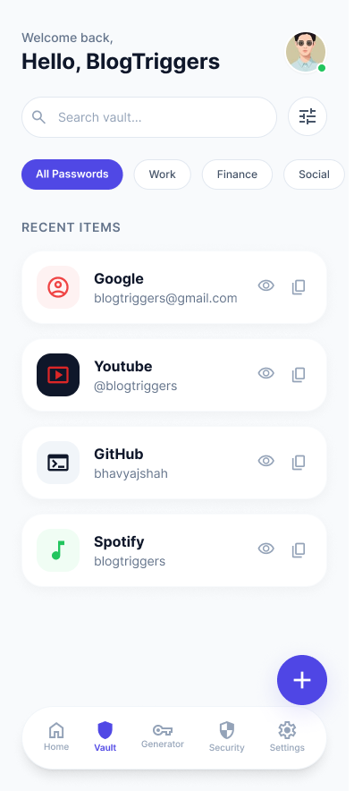
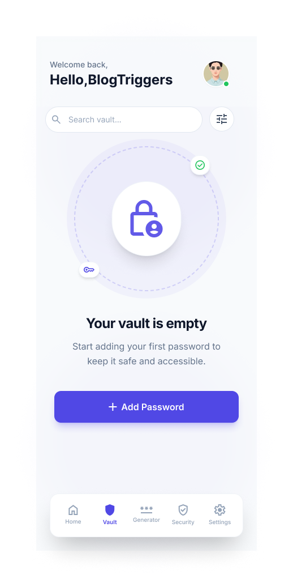

# PassVault

PassVault is an open-source mobile application designed to securely store and manage your passwords in one place. Built with privacy and simplicity in mind, PassVault helps users protect sensitive credentials with strong encryption, biometric authentication, and seamless device syncing.

## ✨ Features

* 🔐 **AES-256 Encryption**
  All passwords are encrypted using industry-standard AES-256 encryption before being stored.

* 👆 **Biometric Lock**
  Unlock your vault quickly and securely using fingerprint or face authentication (supported devices only).

* ☁️ **Sync Across Devices**
  Access your passwords securely across multiple devices with sync support.

* 📱 **Mobile First Experience**
  Clean, fast, and intuitive mobile interface for everyday use.

* 🛡️ **Privacy Focused**
  Your sensitive data stays protected and encrypted.

* ⚡ **Open Source**
  Transparent and community-driven development.

## 📸 Screenshots

| Home                                       | Vault                               |
|--------------------------------------------|-------------------------------------|
|  |  |
## 🚀 Getting Started

### Prerequisites

* Node.js
* Expo CLI or React Native CLI
* Git

### Installation

```bash
git clone https://github.com/Nithish876/PassVault.git
cd PassVault
npm install
npm start
```

## 🔒 Security

PassVault uses:

* AES-256 encryption for stored passwords
* Secure local storage
* Optional biometric authentication
* Strong privacy-first architecture

> Important: Always use a strong master password.

## 🛠️ Built With

* React Native / Expo
* TypeScript
* Secure storage libraries
* Cloud sync backend

## 🤝 Contributing

Contributions are welcome!

1. Fork the repository
2. Create your feature branch
3. Commit changes
4. Push branch
5. Open a pull request

## 📄 License

This project is licensed under the MIT License.

## 🌍 Why PassVault?

Most password managers are closed-source or overly complex. PassVault aims to provide a simple, transparent, and secure alternative for everyone.

## ⭐ Support

If you like this project, consider giving it a star on GitHub.
